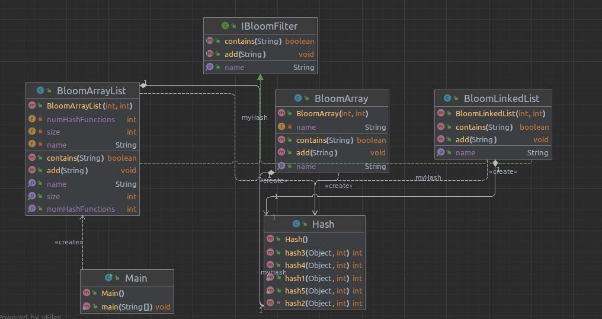
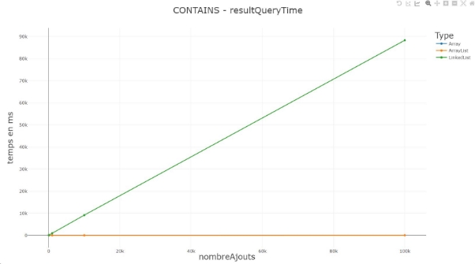
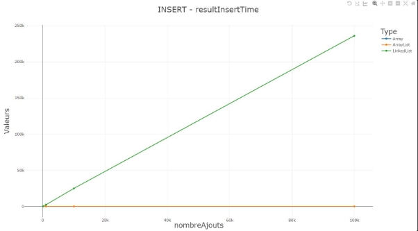
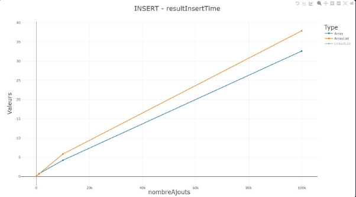
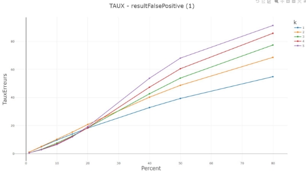

Le Flohic Carole S3B

**Rapport  implémentation du filtre de Bloom**

**Sommaire :**

[**Mise en contexte:](#_page2_x72.00_y72.00) **[3** ](#_page2_x72.00_y72.00)[Définition filtre de bloom :](#_page2_x72.00_y298.13) [3**](#_page2_x72.00_y298.13)**

[**Implémentations de mon filtre de bloom :](#_page3_x72.00_y72.00) **[4** ](#_page3_x72.00_y72.00)[Classe Structures de données :](#_page3_x72.00_y150.02)** [4 ](#_page3_x72.00_y150.02)[Classe Hash :](#_page3_x72.00_y496.68) [4](#_page3_x72.00_y496.68)

[**Implémentations de mon benchmark :](#_page4_x72.00_y380.45) **[5** ](#_page4_x72.00_y380.45)[Test de comparaisons de temps des différentes méthodes  :](#_page4_x72.00_y531.21)** [5 ](#_page4_x72.00_y531.21)[Paramètres des tests de comparaisons de temps :](#_page4_x72.00_y601.49) [5 ](#_page4_x72.00_y601.49)[Interprétation comparaisons des temps :](#_page5_x72.00_y72.00) [6](#_page5_x72.00_y72.00)

[Comparaisons du temps de la méthode contains pour chaque structure de données : 6](#_page5_x72.00_y377.47)

[Comparaisons du temps de la méthode INSERT pour chaque structure de données : 7](#_page6_x72.00_y72.00)

[Comparaisons du temps de la méthode INSERT pour le tableau et l’arrayList :](#_page6_x72.00_y400.21) [7 ](#_page6_x72.00_y400.21)[Test de taux d’erreurs :](#_page7_x72.00_y95.19) [8 ](#_page7_x72.00_y95.19)[Paramètres test de taux d’erreurs](#_page7_x72.00_y685.43) [8 ](#_page7_x72.00_y685.43)[Étape du test :](#_page8_x72.00_y115.64) [9 ](#_page8_x72.00_y115.64)[Interprétation des résultats :](#_page8_x72.00_y290.19) [9](#_page8_x72.00_y290.19)

[Taux de faux positives pour k fonctions de hash et en fonction du pourcentage ajouté 9](#_page8_x72.00_y421.11)

[**Conclusion :](#_page9_x72.00_y72.00) **[10**](#_page9_x72.00_y72.00)**

**Mise en contexte:**

Lors de ce projet, nous avons dû implémenter un filtre de bloom en utilisant plusieurs structures de données, un tableau simple, une arrayList et une linkedList.

Ensuite, nous devions implémenter un benchmark (banc d’essais).

Dans celui-ci, nous devions comparer les temps d'exécution d’insertion et de recherche de l'ensemble de nos structures de données.

Pour finir, nous devions analyser pour l’une des implémentations, le taux d’erreur du test d’appartenance.

Mon filtre de bloom est composé de 5 fonctions de hash.

**Définition filtre de bloom :**

Un filtre de Bloom est une structure de données probabiliste peu encombrante, utilisée pour vérifier si un élément est membre d'un ensemble.

Il fonctionne en représentant l'ensemble sous la forme d'un tableau de bits normalement, dans notre cas un tableau de booléen, et en utilisant plusieurs fonctions de hachage pour affecter les éléments à différentes positions dans le tableau.

Le filtre de Bloom renvoie "possiblement dans l'ensemble" pour les éléments qui ont été hachés, et "certainement pas dans l'ensemble" pour les éléments qui n'ont pas été hachés.

L'un des principaux avantages d'un filtre de Bloom est qu'il peut tester l'appartenance à un ensemble en un seul passage sur les données, sans avoir à stocker les éléments réels de l'ensemble. Cela le rend utile dans les scénarios où l'espace est limité, ou lorsqu'il n'est pas pratique de stocker l'ensemble en mémoire.

Toutefois, cette efficacité a pour contrepartie que le filtre de Bloom peut produire des faux positifs, c'est-à-dire qu'il indique qu'un élément fait partie de l'ensemble alors que ce n'est pas le cas.

La probabilité d'un faux positif peut être contrôlée en ajustant la taille du tableau de bits et le nombre de fonctions de hachage utilisées.

Les filtres de Bloom sont utilisés dans de nombreuses applications, notamment pour la vérification orthographique, la détection des doublons et l'analyse du trafic réseau.

**Implémentations de mon filtre de bloom :**

Comme spécifié dans le sujet, j’ai implémenter mon filtre de bloom accompagné des différentes structures de données, un tableau simple, une arrayList et une linkedList.

**Classe Structures de données :**

J’ai créé 3 classes, bloomArrayList, bloomArray et bloomLinkedList.

Elles implémentent toutes les trois l’interface IBloomFilter qui leur fournit les méthodes “contains”, “add” et “GetName”.

Elles implémentent toutes ces méthodes en fonction de leurs usages et leurs types.

Leurs constructeurs, prennent en paramètres la taille(m) et le nombre de fonctions de hash(k).

Elles ont comme attributs :

- Types de données
- Nombre de fonctions de hash
- Nom du type de données
- Une instance de la classe hash

La classe BloomArrayList, représentation de l’arraylist pour ce filtre, possède des méthodes supplémentaires tel que getSize(), getNumHashFunctions() car cette classe va permettre d'implémenter les tests du benchmark pour le taux d’erreur du test d’appartenance.

**Classe Hash :**

La classe Hash à également été implémentée regroupant les 5 fonctions de hash utilisées dans ce filtre.

Elles utilisent la fonction hashcode de java.

**Diagramme UML :**

**Implémentations de mon benchmark :**

Mon benchmark a effectué l’ensemble des tests de performance demandés.

C'est-à-dire, il compare les temps d'exécution des trois structures de données pour l’insertion des données et la recherche de données.

Il analyse le taux d’erreur du test d’appartenance en fonction du nombre de fonctions de hash données aux structures, la taille du filtre (m) et le pourcentage ajoutée (n).

**Test de comparaisons de temps des différentes méthodes  :**

**Paramètres des tests de comparaisons de temps :**

- Taille des filtres :
  - 1 000 000
- Nombre d'éléments tester :
  - 100,1000,10000 et 100000.
- Nombre de fonctions de hash utilisé pour chaque test :
  - 5

**Interprétation comparaisons des temps :**

Mes méthodes de test pour calculer le temps prennent en paramètres le nombre d’éléments à ajouter/chercher.

Je teste avec les valeurs citées précédemment.

Après observation des différents graphes ci-dessous et des valeurs obtenus lors des tests, nous pouvons observer que l’arrayList est un petit peu plus rapide que le tableau simple.

La linkedList elle est bien plus lente que les deux différentes structures de données. La différence de vitesse peut être expliquée par le fait qu'en général, les tableaux sont plus rapides pour accéder aux éléments individuels et les modifier, car les éléments sont stockés dans des emplacements mémoire contigu et peuvent être accédés directement par leurs indices.

En revanche, les linkedList sont plus lentes pour ces opérations, car elles nécessitent des pointeurs pour accéder à l'élément suivant de la liste.

**Comparaisons du temps de la méthode contains pour chaque structure de données :**

**Comparaisons du temps de la méthode INSERT pour chaque structure de données :**

On peut voir une différence très conséquente entre l’arrayList, le tableau par rapport à la linkedList qui est beaucoup plus lente.

**Comparaisons du temps de la méthode INSERT pour le tableau et l’arrayList :**

On peut voir que l’arrayList va un peu plus vite.

**Test de taux d’erreurs :**

Le taux d’erreurs correspond aux nombre de faux positifs retournés pour un certain ensemble. C'est-à-dire le nombre d'éléments retournés comme étant dans le filtre mais qu’ils ne le sont pas.

- Exemple :
  - Ajout du mot “mario” dans le filtre de bloom
  - 
    - Source : https://dridk.me/bloom-filter.html
  - Ajout du mot “zelda”
  - 
  - **Source** : <https://dridk.me/bloom-filter.html>

Dans cet exemple lors de l’ajout du mot zelda le filtre retournera que le mot “zelda” est déjà dans le filtre alors que ce n’est pas le cas.

C’est le principe du faux positif.

Les tests implémentés vont permettre de calculer le taux de faux positif sur un certain nombre d'essais en variant le nombre de fonctions de hash utilisées.

**Paramètres test de taux d’erreurs**

- Percent : pourcentage d'éléments ajouter dans le filtre en fonction de la taille du filtre
- K : le nombre de fonctions de hash utilisé pour le test
- Le paramètre “percent” prend chacune des valeurs une par une:
  - 1%, 5%, 10%,15%, 20%, 40%, 50%, 80%
- Le paramètre k(nombre de fonctions de hash) prend les valeurs:
  - 1,2,3,4,5

**Étape du test :**

- Calcul du nombre d'éléments à ajouter dans le filtre en fonction de la taille du filtre
- Ajout des éléments généré dans le filtre Création d’un ensemble de String composé d'éléments n'étant pas dans le filtre créé précédemment
- On parcourt l’ensemble des valeurs de ce set en testant avec la méthode contains du filtre.
  - Si le filtre retourne que l'élément est à l'intérieur, on ajoute un faux positifs
  - Sinon on ne fait rien

-Ensuite, on calcule le taux par rapport aux nombres d’essais effectués. ( 10 000 dans chacun de nos cas)

**Interprétation des résultats :**

On peut voir d’après le graphique ci-dessous différents graphiques que plus le pourcentage ajouté est grand plus le taux est grand notamment. Également plus on a de fonctions de hash plus il y a de **collisions** ce qui explique les taux des taux aussi grand.

À l'opposé, plus le pourcentage ajouté est faible plus les tests avec le plus de fonctions de hash utilisé plus le taux d’erreurs est bas.

**Taux de faux positives pour k fonctions de hash et en fonction du pourcentage ajouté**

**Conclusion :**

Pour conclure ce projet, j’ai trouvé ce projet très intéressant notamment le fait d’effectuer des tests de performances grâce aux benchmark implémenter. Étant quelque chose que je n’avais pas encore implémentée cela m’a particulièrement plu.

J’ai pu également découvrir le principe de bloom qui m’était également inconnu.
